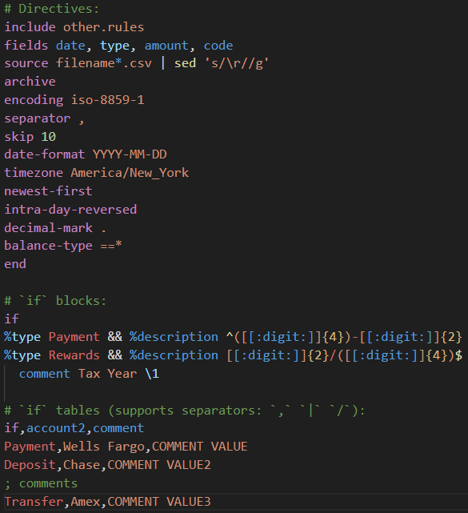
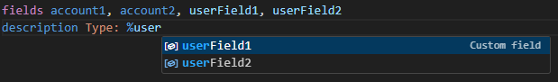
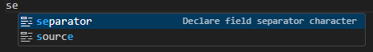
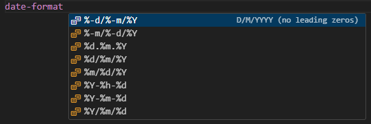

# hledger-rules-vscode

Language support for
[hledger CSV-parsing rules.](https://hledger.org/1.50/hledger.html#csv)

## Features
### Syntax highlighting:

### Completions:

## Planned Features
- [x] Syntax highlighting
  - [x] POSIX-extended regular expression highlighting
- [x] Completions
- [ ] Snippets
- [ ] Linting
- [ ] Formatting

## Testing

Snapshot testing is used to test syntax highlighting via
[vscode-tmgrammar-test](https://github.com/PanAeon/vscode-tmgrammar-test).
